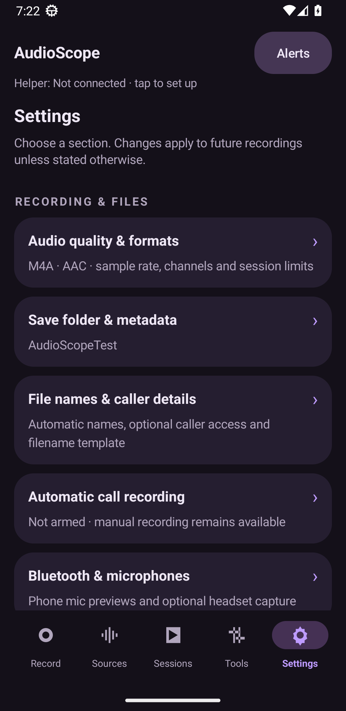

# AudioScope

An offline Android recording app with a dark purple Material 3 interface, selectable accents, live source meters, and separate audio tracks. Android 13+. Package `dev.audioscope`. Version **0.5.0**.


Standard text (100%) is the default. Settings also offers Small (85%) and Large (115%). Source labels and status text use a consistent sans-serif hierarchy.

## Settings and advanced setup

Settings opens eleven separate pages for audio quality, storage, names, automatic calls, Bluetooth, appearance, notifications, helper connection, background/offline use, advanced capture and About. Descriptions use the full width below each switch title so explanations can wrap without competing with the control.

Background & offline recording adds actual USB/Wireless debugging readback, default USB functions, an opt-in Restart capture helper without Wi-Fi endpoint, a stoppable wireless-debugging guard, battery links and reboot/update reminders. Recording stays local without internet; restart transport is a separate feature. TCP setup is not restricted to loopback by Android, and must be re-enabled after reboot. Protected microphone handoff and automatic post-boot recovery are not claimed.



Read the [full CallVault comparison](docs/CALLVAULT-COMPARISON-2026-10-05.md) for settings/feature differences and a prioritized reliability, per-app detection and efficiency roadmap. [Release notes](docs/RELEASE-0.5.0.md) and [validation](docs/VALIDATION.md) describe this build.

## Record and compare

- **Record:** source selections and presets, an optional recording name, pause/resume, bookmarks, and live signal health. Stop saves independent tracks and any configured mixes.
- **Sources:** seven common routes shown initially; 21 specialist routes in a collapsed Hidden sources group. While idle, shown playback routes and **Any Phone Mic** can preview. Other microphone presets and named external/headset inputs require Start monitoring. Only one physical mic preview owns the input at a time. All extra previews pause during recording; Sources displays the recording tracks’ existing waveforms and explains why conflicting previews cannot start. Pencil mode supports drag ordering, Move up, Hide and Show. Detailed, Comfortable, Compact and two-column Mini views are saved. Compact routes expose format and error details by tapping their name or waveform.
- **Record all** records every non-hidden source. Its red indicator requires an explicit Record all action and actual PCM from every non-hidden route. Expanded hidden sources remain excluded. Gray dots turn red while that source records. Monitoring waveforms are gray; recording waveforms use the accent color. Peaks are interpolated on display frames. Concurrent routes may compete for hardware; a visible waveform reports actual PCM, not a successful API call.
- **Auto recommendation:** compares smoothed measured levels and recommends multiple audible routes within 12 dB of the strongest signal, above the silence threshold. Record recommended sources starts independent tracks, or adds them to an active session. This does not start ambient recording automatically.
- **Automatic calls:** user-armed foreground service detects answered phone calls or communication audio mode, debounces state changes, and attempts VoIP/Wi-Fi playback + microphone + carrier capture. It ends only an automatic session when the call ends; manual sessions remain manual. Stopping during a call suppresses restart until the next call. Arm while the app is open; re-arm after reboot or process termination.

## Listen and find files

Sessions uses compact recording cards with inline play/pause, a real waveform and elapsed/duration labels. Tap a recording to open its dedicated full-screen view with all tracks, waveform seeking, ten-second skips, playback speed, rename and sharing. When a mono mix exists, it is the default inline player; the full-screen view retains every individual source track. One media-session player persists across screens.

Settings → Save folder & metadata selects a persistent Android document-tree destination. Audio is staged privately and copied only after encoding completes, with a temporary-name/rename workflow where supported and a finished-file fallback for other providers. A JSON sidecar can accompany custom-folder exports. Default copies use MediaStore in **Recordings/AudioScope** (raw PCM: **Downloads/AudioScope**). Local custom copies request media scanning for Files/Recent; cloud providers manage their own Recent list. Private WAV originals, timing and logs remain available from the full-screen recording’s Files & details / Share session.

Optional automatic naming uses date, call app, known direction and available caller/contact, with an editable filename template. Phone call-log/contact permissions and VoIP notification access are optional controls in Settings. Only ongoing call notifications are used. Unknown caller/app/direction stays empty; multiple ambiguous call notifications do not select a guessed caller. Call information stays local. A custom recording label remains available.

**Any Phone Mic** is the default flexible input. It starts with ordinary MIC and requests the built-in device, tries other local input presets if opening fails, accepts Android’s non-Bluetooth microphone changes (including wired/USB inputs), and can recover a dead recorder within the same track. Regular Microphone accepts built-in and telephony routes instead of falsely labelling a telephony route external. Confirmed Bluetooth audio is discarded by phone sources. Temporary wrong or unreported routes have a short recovery window; persistent routing failure is reported instead of saving audio from the wrong device.

Connected headsets add **Any Bluetooth Mic** and three input presets. **Show each connected microphone** also adds sources with the Bluetooth, USB and wired device names Android exposes. These inputs never preview automatically: tap **Start monitoring** or Record explicitly. Headset recording is pinned to the requested device and holds AudioScope’s communication route until its last preview/recording stops; preview-to-record handoff retains that ownership. Another named headset cannot steal the active route. Android may expose only one usable Bluetooth mic at a time, and a disconnected input cannot be held. Settings includes **Record Bluetooth mic now**, preferred headset, route-holding and preparation switches, sample rate, phone-preview control and idle-route release. Activating a headset mic can interrupt non-call media. Managed phone-call routing remains controlled by Android Telecom.

Settings → Audio quality & formats → Default audio format changes **every source selector** and clears old per-source overrides. Available formats are M4A/AAC, WAV, Opus/WebM and raw PCM. Apply default to every source also resets overrides without changing the default. Encoded files are produced after capture; encoder failure preserves and publishes the WAV instead and posts a repair notification.

## Setup and notifications

Embedded ADB uses the CallVault-style workflow: local mDNS discovery, direct Wireless debugging navigation, an inline notification reply for the six-digit code while Android Settings stays open, then automatic connection-port discovery and helper startup. No account, desktop, cloud processing or internet upload is needed. After connection, the detached Binder helper continues capture without Wi-Fi. Reboot ends it.

Shevery/Shizuku setup requests missed Binder delivery, asks for app authorization, uses a versioned user service and reports connection failures. Embedded ADB remains an independent path. See [setup](docs/SETUP.md).

Recording notifications have pause/resume, bookmark and stop. Playback has play/pause and skip controls. Setup, saved recordings, automation, low storage, codec failures and source failures have separate updates. Source errors contain readable explanations, repair steps and their original technical detail. Alerts opens an in-app notification history, including events when Android notifications are disabled. Manage channels and optional routine updates in Settings.

## Tools

Five-second probes, sequential source sweeps, generated-tone pipeline tests, WAV-header repair, device/helper inspection, diagnostic export and filterable logs. Mono mixing is enabled by default, including on upgrade to 0.5; it can be disabled. Normalize track levels in mix is separately configurable (on by default): a peak pass targets −3 dBFS per track with amplification capped at about 12 dB, then the existing weighted mixer adds headroom. Normalization affects only the mix and preserves original audio; it is not speech loudness matching. Routing also supports left/right stereo, per-source gain/mute and named PCM tracks in an MKA container. Originals retain captured PCM.

The source catalog exposes 28 local input/preset and playback choices, four conditional Bluetooth choices and optional named connected inputs, including legacy aliases and experimental remote submix. Hidden sources do not consume preview resources unless expanded and idle; explicit mic inputs still need a tap. Closing a preview releases its unpinned playback policy. Explicitly pre-armed policies remain until disarmed. Remote submix can redirect speaker audio.

## Device behavior and validation

The user verified **0.1.0** capturing a Wi-Fi voicemail call on an S23 Ultra through VoIP/Teams playback where another recorder was silent. Versions 0.3–0.5 preserve that voice-communication policy path and include it in automatic call candidates. A listed route can still be rejected, unavailable or silenced by Android/OEM policy. Audio initialization alone does not prove both call parties are captured.

No empty source selection creates a session; failed starts producing no PCM are removed. Silent PCM with real frames is retained, so silence can be diagnosed. See [the requirements audit](docs/REQUIREMENTS-0.3.0.md) and [validation](docs/VALIDATION.md) for completed checks and remaining S23 tests. New physical-device behavior is not claimed from emulator results.

## Build and test

JDK 17, Android SDK platform 35, build tools 34.0.0. Set `sdk.dir` in ignored `local.properties`, or use Android Studio:

```sh
./gradlew testDebugUnitTest lintDebug assembleDebug assembleDebugAndroidTest
```

Run device regression tests on a disposable emulator, with microphone and notification permissions granted and its Wi-Fi debugging network approved:

```sh
adb shell am instrument -w -e class dev.audioscope.MicRegressionTest dev.audioscope.test/android.test.InstrumentationTestRunner
adb shell am instrument -w -e class dev.audioscope.SettingsRegressionTest dev.audioscope.test/android.test.InstrumentationTestRunner
adb shell am instrument -w -e class dev.audioscope.FeatureRegressionTest dev.audioscope.test/android.test.InstrumentationTestRunner
# Requires the current shell-helper fixture and notification permission:
adb shell am instrument -w -e class dev.audioscope.SettingsUiRegressionTest dev.audioscope.test/android.test.InstrumentationTestRunner
```

Selecting the test class avoids the legacy runner scanning unrelated compatibility classes inside dependencies. The NSD test registers a temporary local pairing service; it does not send a real pairing code or start an external device's helper.

For release signing, use ignored `signing.properties` (`storeFile`, `storePassword`, `keyAlias`, `keyPassword`) and `./gradlew assembleRelease`. The private local key must be preserved to update existing installations; source archives exclude it. The optional Windows `AUDIOSCOPE_JAVAC` workaround does not change normal build requirements.

## Source and license

Public repository: [ibrahim91015/AudioScope](https://github.com/ibrahim91015/AudioScope). `Publish-GitHub.ps1` verifies the local GitHub account, pushes source and the version tag without force, and uploads the signed APK and corresponding source ZIP. Run in a normal PowerShell terminal when Windows Credential Manager is unavailable to the Codex process.

AudioScope is an independently modified fork / edited derivative of capture and daemon components from [CallVault](https://github.com/madkongo/CallVault) and [ShizuCallRecorder](https://github.com/kitsumed/ShizuCallRecorder). [Shevery](https://github.com/HmnDev-Tech/shevery) is optional and is not bundled. GPLv3-or-later with upstream Section 7 terms; see [LICENSE](LICENSE) and [NOTICE](NOTICE). No analytics or cloud service. Only record where you have permission.
