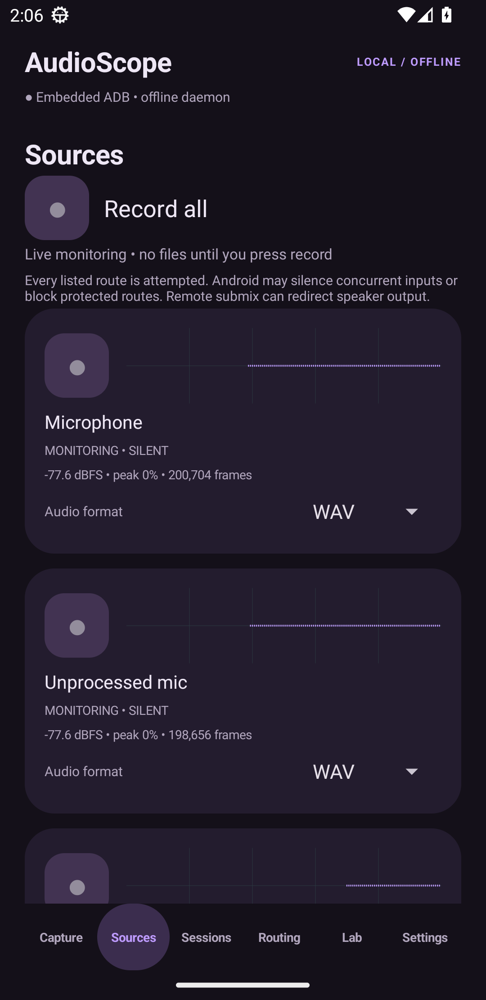

# AudioScope

An offline Android audio capture console with a dark purple Material 3 interface and selectable accents. Package: `dev.audioscope`. Android 13 or newer. Version 0.1.0 is an experimental device build.



## What it does

- **Sources:** continuously meters every listed input and playback route while this tab is visible. Rounded square recording buttons have gray dots when monitoring and red dots while recording. Record all attempts all 27 routes concurrently. Each source has a WAV, raw PCM, AAC or Opus selector. Monitoring does not save audio.
- **Capture:** manual source selection, presets, independent start/stop, session pause/resume, bookmarks, horizontal waveforms and measured signal health. Optional signal-aware carrier fallback retains every attempted track.
- **Sessions:** local file playback, inspection and sharing of files or complete session ZIPs.
- **Routing:** separate original tracks, selectable left/right stereo, normalized mono mix, gain/mute and named PCM tracks in a Matroska audio container.
- **Lab:** five-second probes, sequential source sweeps, generated-tone pipeline tests, interrupted WAV header repair, route/permission inspection and exportable diagnostic logs.
- **Settings:** a dedicated tab for purple/lilac/blue/teal/rose/amber/wallpaper accents, sample rate, channels, encoded bitrate, UID filters, raw PCM, silence thresholds, session limit and privilege setup.
- **Background capture:** foreground notification with Pause/Resume, Bookmark and Stop actions; a configurable wake lock and periodic WAV/manifest checkpoints.

## Capture routes

Physical input presets: microphone, default, performance, unprocessed, recognition, communication and camcorder. Telephony inputs: VOICE_CALL, uplink and downlink. Playback buses: media, game, voice communication/Teams, navigation, assistant, alarms, notifications and unknown usage, signalling, ringtone, accessibility, interface sounds, event notifications and the three legacy communication-notification aliases. All public input-source and playback-usage constants are exposed; undocumented vendor-private routes are not enumerated. Remote submix is an additional experimental route.

**A listed route is an attempt, not a guarantee of usable audio.** Android can reject sources, silence competing inputs or return zero-filled buffers. Hardware and OEM policy determine telephony, Bluetooth, Wi-Fi Calling and VoIP behavior. The app reports blocked, failed, low-signal or silent sources rather than treating successful initialization as proof. Record all is intentionally unrestricted; it can consume significant CPU/battery and remote submix can redirect normal output.

## Install and use

Install the provided signed APK and grant microphone and notification permissions. Basic microphone recording works without a helper. For protected routes, connect either Shizuku/Shevery or the embedded on-device ADB helper from Settings. See [setup and offline behavior](docs/SETUP.md).

For a Teams/app call, arm communication loopback before joining, then record mic plus communication playback. Check both waveforms and listen to the saved tracks. For a carrier call, probe VOICE_CALL and the separated uplink/downlink routes. No automatic call interception or call-type classification is required.

The Sources tab starts metering when visible and stops monitoring when the app loses foreground focus or another tab is selected. Recordings continue in the foreground service after leaving that tab. Previewing protected playback requires the shell helper; the Capture tab also provides public Android playback-capture consent for eligible media/game/unknown playback.

## Files and processing

Files stay in `Android/data/dev.audioscope/files/sessions`. Each recording retains PCM16 WAV originals, timing JSONL sidecars, a session manifest, bookmarks and session logs. PCM adds headerless `.pcm`; AAC adds `.m4a`; Opus adds `.webm`. Encoded copies are created after stopping. Codec failures are logged and preserve WAV originals. Individual source format overrides are independent of the global format used for routed outputs.

Stereo/mix exports align track starts and linearly compensate their measured clock span. They are offline exports, not live audio injection. Matroska preserves each track's native sample clock and start offset. Capture is PCM16; FLAC, floating-point capture, virtual microphone injection and automatic long-file rotation are not implemented in this version. WAV files have the standard RIFF size limit; interruption repair restores headers but cannot recover audio never written.

## Build

Use JDK 17, Android SDK platform 35 and build tools 34.0.0. Create `local.properties` with `sdk.dir=...`, or use Android Studio. Run:

```sh
./gradlew testDebugUnitTest lintDebug assembleDebug
```

For a signed release, create an ignored `signing.properties` with `storeFile`, `storePassword`, `keyAlias` and `keyPassword`, then run `./gradlew assembleRelease`. Without this file, the release APK is unsigned. Keep signing credentials private and backed up; they are needed to update the installed app. This checkout already has a private release key in its ignored `signing/` directory. Source archives exclude it.

See [verification and remaining device checks](docs/VALIDATION.md). The Windows sandbox compiler workaround `AUDIOSCOPE_JAVAC` is optional and does not change the normal JDK 17 build requirements.

## Versioning and publication

This project is a local Git repository. [Publish-GitHub.ps1](Publish-GitHub.ps1) creates or reuses `ibrahim91015/AudioScope`, verifies the authenticated account, pushes source history and tags, and publishes the APK with its corresponding source archive. Run it from a normal local terminal if the Codex process cannot access Windows Credential Manager. It never publishes the signing key, local settings, research documents or recordings.

## Attribution

**AudioScope is an independently modified fork / edited derivative of ShizuCallRecorder and CallVault capture/daemon components.** Original projects: [ShizuCallRecorder](https://github.com/kitsumed/ShizuCallRecorder), [CallVault](https://github.com/madkongo/CallVault). [Shevery](https://github.com/HmnDev-Tech/shevery) is an optional privilege manager; it is not bundled.

The redesigned UI, manual source controls, metering, timestamped transport and file-processing pipeline are AudioScope changes. Distributed under GPLv3-or-later with the upstream Section 7 terms in [LICENSE](LICENSE). See [NOTICE](NOTICE). No cloud account, analytics or upload service is used. Network permission supports local ADB. Only record where you have permission.
